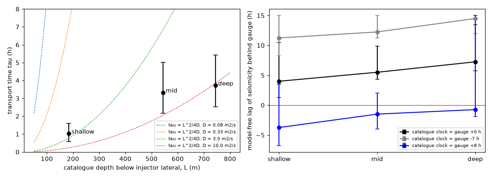
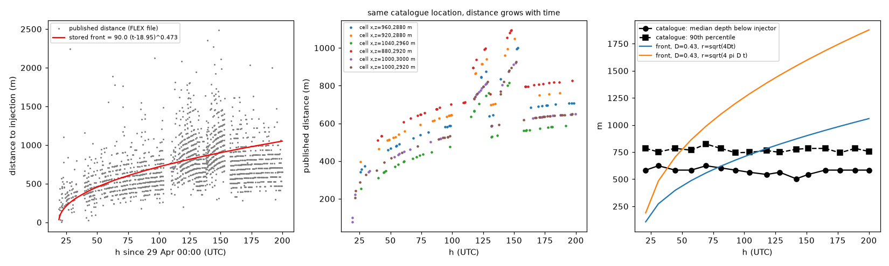
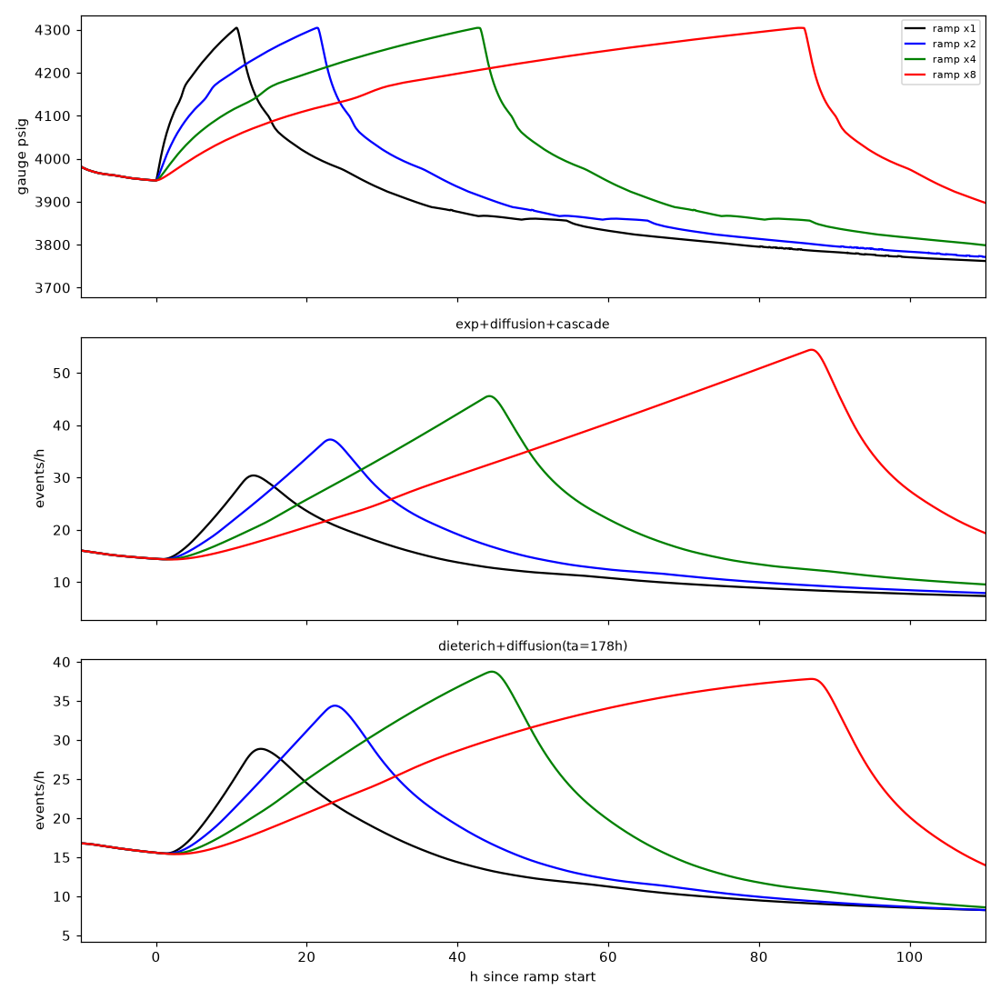

# Why do earthquakes lag behind pressure at Blue Mountain?

**The models favour pressure taking time to reach the faults. Deeper earthquakes tend to respond later.** This reading assumes the pressure and earthquake records share a clock, which remains uncertain.

This reanalysis uses the 2023 geothermal test at Blue Mountain, Nevada. Of five pressure cycles, only cycle IV gives a clear timing signal. Cycle V also responds, but missing data limit the timing evidence.



**Depth matters, but the clock sets the size of the delay.** Left: fitted response times rise with depth. These model times are not the observed lag. Right: timing measured from the records keeps the same depth order under different clock assumptions. The wide bars show uncertainty. The data do not establish how delay scales with distance.



**The distance records leave an open question.** Left: the published curve is reproduced from the supplied files. Centre: published distances grow even for events at the same catalogue location. Right: catalogue depths stay roughly steady. How those distances were calculated is undocumented, so this does not establish that the earthquakes moved deeper.

Faster pressure rises also reached higher pressures. The observed cycles therefore cannot tell us what changing rise speed alone would do.



**Slower rises predict more earthquakes, with a smaller gap between peaks.** Top: pressure rises to the same peak over longer times. Below: the best model and an alternative allowed by the data predict the response. They disagree on how high the earthquake rate rises. It takes longer to reach half the peak increase, even though the peaks move closer together. These are predictions beyond the observed cycles, not measurements.

A proposed follow-up would compare fast and slow rises to the same pressure, then hold a higher pressure. A shared clock, better earthquake locations and pressure measured at earthquake depth would help test the explanation.

## Details, reproduction and licences

[FINDINGS.md](FINDINGS.md) gives the technical analysis and proposed test; [results/](results/) holds the numbers and [blm/](blm/) the code.

Inputs are included. Use Python 3.12, `uv`, `make` and Git. From the repository root:

```sh
uv venv --python 3.12 .venv
uv pip install -r requirements.txt
make all
```

The full run uses six worker processes and rewrites results, figures, `FINDINGS.md`, `REPORT.md` and `COMPLETE.md`. `make light` reuses saved validation and design runs.

Chamarczuk and colleagues' [OSF data](https://doi.org/10.17605/OSF.IO/D65BA) and [accepted manuscript](https://doi.org/10.1029/2025JB031634) are CC BY 4.0. USGS ComCat earthquake records are public domain. The Iowa Environmental Mesonet supplied the Winnemucca ASOS weather records; no licence is recorded here for them. See [data/README.md](data/README.md) for OSF provenance and checksums. The code is [MIT licensed](LICENSE); data retain their own licences.
